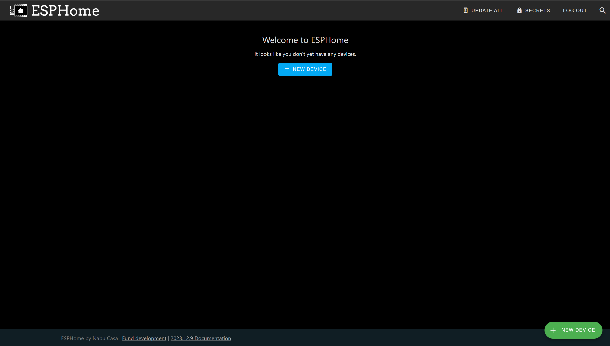
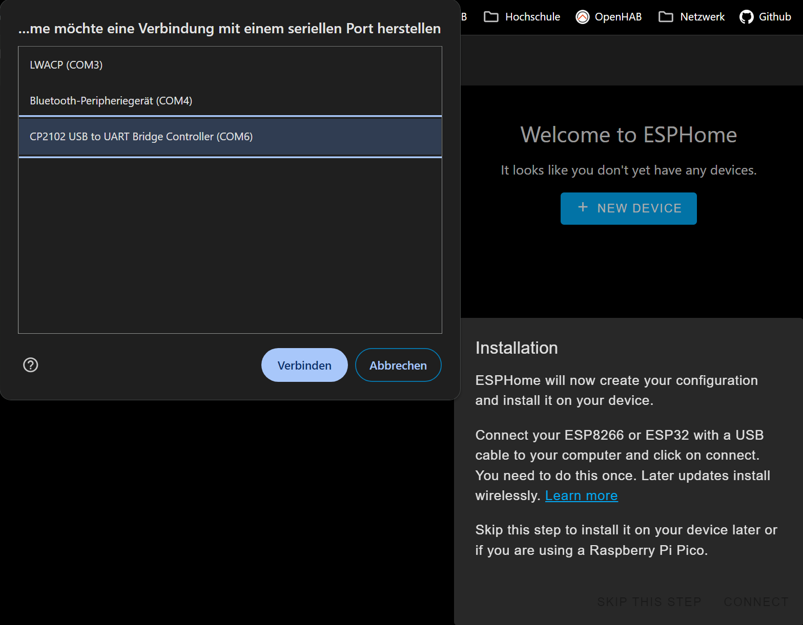
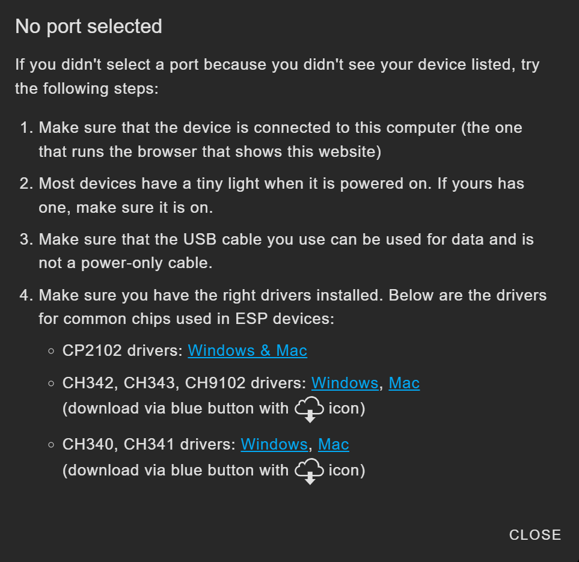
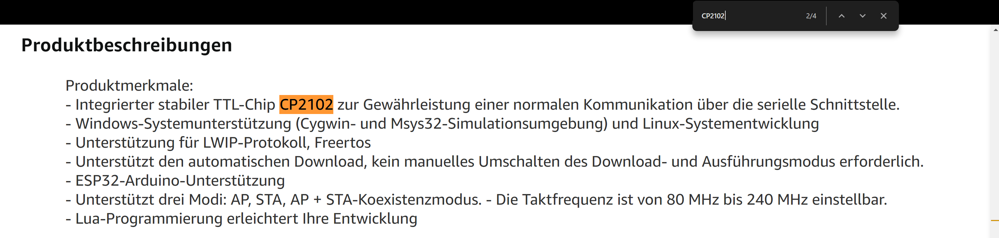
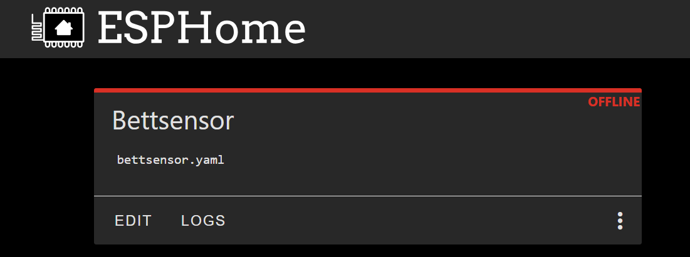
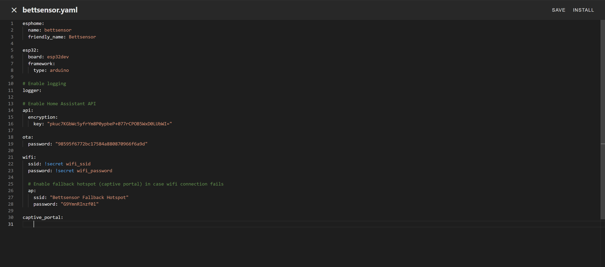
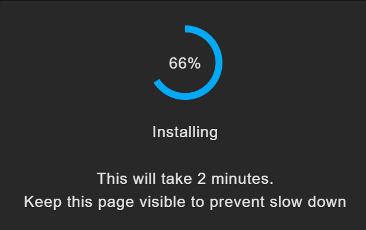
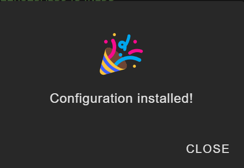

# Introduction
The goal of this project is to create a presence sensor for a bed that reports its state to Home Assistant and thus can be used in automations. This is achieved by using two pressure sensors attached to an ESP32 micro controller which then relays the information about each half of the bed to the home automation server.

# Fundamentals
First of all, we want to cover some of the basics that will be necessary for this project.

## What is ESPHome?
ESPHome is an open source platform that allows users to configure microcontrollers and integrate them into smart home systems such as Home Assistant. As such microcontrollers are very inexpensive, they are ideal for implementing your own smart home projects.

ESPHome can be setup quite easily. There is a test version available at [https://web.esphome.io/](https://web.esphome.io/) and it can be self-hosted (for free) with Home Assistant or as an independent Docker container. I will go into further details on this in the [`setup`](#setup-of-esphome) part later.

## Which devices does ESPHome support?
ESPHome *primarily* supports microcontrollers from the ESP8266 and ESP32 families, both manufactured by the Chinese company [*Espressif Systems*](https://www.espressif.com/). Some of the popular microcontrollers that can be used for ESPHome projects include the following:
* ESP8266-based microcontrollers
  * [NodeMCU](https://www.nodemcu.com/)
  * [Wemos D1 Mini](https://www.wemos.cc/en/latest/d1/d1_mini.html)
  * [ESP-01](https://www.utmel.com/components/esp-01-wi-fi-module-esp-01-pinout-programming-and-esp-01-vs-esp8266-faq?id=990)
  * [ESP-12E and ESP-12F](https://www.elecrow.com/blog/things-you-should-know-about-esp8266-wifi-module.html)
* ESP32-based microcontrollers
  * [ESP32 Dev Kit](https://www.espressif.com/en/products/devkits/esp32-devkitc)
  * [Wemos D32](https://www.wemos.cc/en/latest/d32/d32.html)
  * [ESP32-CAM](https://www.arducam.com/esp32-machine-vision-learning-guide/) (an ESP32 based system which offers an onboard camera module for around $7)

ESP32 and ESP8266 are *only* the chips themselves: They are the platforms and are manufactured by *Espressif Systems*. These are *System on a Chip* (SoC) designs, meaning they integrate various components such as CPU, memory, and wireless connectivity onto a single chip.

There are several variants of these chips: Espressif Systems offers different ESP32/ESP8266 chip variants with varying features such as number of cores (single or dual), clock speed, and memory capacity.

These SoCs are then placed on different boards: Several companies produce development boards specifically designed for ESP32/ESP8266 chips. These boards typically include additional components such as voltage regulators, USB ports, and breakout pins for connecting external sensors or devices.

Although ESPHome primarily runs on [ESP32](https://esphome.io/components/esp32) and [ESP8266](https://esphome.io/components/esp8266)-based platforms it also includes limited support for [RP2040](https://esphome.io/components/rp2040)-based chips and chips based on the [LibreTiny](https://esphome.io/components/libretiny) platform.

# Application Example: A bed presence sensor
In this project we are going to build a presence sensor which reports to Home Assistant whether someone is lying in bed. Moreover we are going to use two sensors which allows us to determine which of the two halfs of a bed are occupied.

I have divided this project into two main sections: First, we'll cover the hardware, and then we'll take a look at the software, where we'll set up ESPHome, among other things.

## Hardware

### Microcontroller
In this project we will use an ESP-32 development board which can be acquired on different platforms like [Amazon.com](https://www.amazon.com/s?k=ESP32), [Amazon.de](https://www.amazon.de/s?k=esp32) or [AliExpress](https://www.aliexpress.us/w/wholesale-esp32.html) for less then $10.

I suggest that you look for a microcontroller that uses USB-C instead of micro-USB to be more future-proof. Unfortunately, I did not explicitly check for this when I ordered my ESP32, so I am stuck with micro-USB. Don't make the same mistake I did.


### Pressure sensor
To determine if someone is in bed, we use a pressure sensor. To be precise: We will use two sensors, one for each half of the bed. This way we can determine if there are `0`, `1` or `2` people in bed. This allows for even more possible automations, which we will cover later.

The pressure sensor we use is a `PM156`, manufactured by the company `COMUS Group`. It can be obtained on different places like [SwitchElectronics](https://www.switchelectronics.co.uk/products/large-pressure-alarm-switch-mat-720-x-390mm-pm156) (where I bought mine from), [Amazon.de](https://www.amazon.de/dp/B07P5Z7L77) or [Ebay](https://www.ebay.co.uk/itm/253756658234). As explained above, I bought two, but this project can be done with just one if you are fine with knowing if there is *someone* in bed and not knowing how many people there are.

This pressure sensor is essentially just a switch. When pressure is applied to the mat it pushes its two halfs together and thus closes the circuit.

The pressure mat looks like this:

> Image source: https://www.multice.com/

It has four cables coming out of it. We only need two: from the perspective of this picture, the bottom two. These two complete an electrical circuit if pressure is applied to the mat. The other two cables are irrelevant for this project.

### Power
To power the ESP32 I am using a standard micro-USB cable which I had lying around. As described above you should use a USB-C cable instead. Any cheap power supply does the job as the microcontroller needs a maximum of ~250 mA.

### Cabling
The completed circuit looks like this:


To the right is the ESP32 microcontroller. On the left you can see the two pressure mats, both connected to the ground of the ESP32 and to a GPIO pin.
> Note: It is important which GPIO pins of the ESP32 you connect the pressure mats to, as different pins have different functions.

Moreover you need to connect the ESP32 to power.

To connect the cables of the pressure mats to the ESP32 I recommend using a breadboard to avoid the necessity of soldering.

### Total cost
To summarize all the hardware costs:
* ESP32: 7,79 €
* Pressure mats: 2 x 14 € = 28 €
* Breadboard: 2 €
* USB cable: 2 €
* Power supply: 5 €
* **Total**: 44,79 €

I had the breadboard, usb cable and power supply lying around at home, so the total cost was only about 35 €.

## Software
After setting up the hardware it is time to take a closer look at the software needed for this project.

### Requirements
For this project we need a computer/server on which ESPHome can run. ESPHome does not need to run all the time, it is only needed for setup. So a computer that is not turned on all the time is fine. However, since you probably have a server where your Home Assistant instance is running, I suggest you deploy ESPHome on the same machine. I just added a section to the `docker-compose.yml` of Home Assistant for ESPHome as you can see below.

### Setup of ESPHome
There are multiple ways to use ESPHome. For testing purposes and initialization of the microcontroller it is possible to use a web hosted version of ESPHome available at [https://web.esphome.io/](https://web.esphome.io/). However this is only a lite variant of ESPHome. For bigger projects it is recommended to self-host ESPHome. There are two ways of doing this:

1. If you have a running Home Assistant instance you can install ESPHome as an add-on. The documentation on how to this can be found [here](https://esphome.io/guides/getting_started_hassio).

   `Note:` This is not always possible. If you have setup Home Assistant with a Docker container refer to option `2`. From the [docs of Home Assistant](https://www.home-assistant.io/addons/):
   > Add-ons are only available if you've used the Home Assistant Operating System or Home Assistant Supervised installation method. If you installed Home Assistant using any other method then you cannot use add-ons.
2. The other way to install ESPHome is to create a container for it. This is a simple `docker-compose.yml` example:
   ```yml
   version: '3'

   services:
     homeassistant:
       build:
         image: ghcr.io/home-assistant/home-assistant:latest
       container_name: homeassistant_app
       restart: always
       volumes:
        - ./data/homeassistant/config:/config
       network_mode: host
     esphome:
       image: ghcr.io/esphome/esphome
       container_name: homeassistant_esphome
       volumes:
         - ./data/esphome:/config
         - /etc/localtime:/etc/localtime:ro
       ports:
         - 6052:6052
       environment:
         - USERNAME=admin
         - PASSWORD=mysecretpassword # Change me
   ```
   After running `docker-compose up` ESPHome can be accessed via an web browser on `<Hostname/IP of the server>:6052`.

   > Hint: *If you are tired of typing in ip addresses or hostnames combined with ports and having your browser warn you about insecure websites because of missing HTTP**S**, take a look at NginxProxyManager. It allows you to access your self-hosted services on FQDNs like esphome.mydomain.com with valid SSL certificates.*

When opening the web portal you will be greeted with a login prompt where you have to enter the credentials you've defined in the `docker-compose.yml` (in this case `admin`:`mysecretpassword`)

When you open ESPHome for the first time, you will be greeted with a *pretty* empty screen:


#### Configuring WIFI

Before adding the microcontroller, we will store the wifi password that the controller will later connect to in ESPHome. This is done in the `SECRETS` in the upper right corner. Enter your credentials like this
```yml
wifi_ssid: "yourWifiSSID"
wifi_password: "yourWifiPassword"
```
This way we can reference the password from the configuration of the microcontroller and all the secrets (you can add other ones as well here) are stored in a single file. This has three main advantages:
1. Your credentials are stored in a single place and not scattered across multiple files, making them easy to find and manage.
2. If you need to change a variable, such as your WIFI password, you only need to change it once.
3. The `SECRETS` are stored in a file called `secrets.yaml`. All the other configurations of ESPHome are also stored in files (and not in a database). This way you can initialize a git repo in the root directory of ESPHome, add the `secrets.yaml` file to the gitignore and keep track of the changes you make.

### Adding the ESP32 to ESPHome

Now we are finally ready to add the microcontroller to ESPHome. Start by clicking on `New Device` and give your project name. I called mine `Bettsensor` (german for `bedsensor`).

Afterwards ESPHome will ask you to connect your device to the computer you are using. Do so and be sure to use a cable which not only provides power but also transfers data.

Click on `Connect` and select your microcontroller from the list.

There can be two things that can make this stage difficult:
1. The device you are trying to connect to does not appear in the list: Don't worry, this happened to me. Click on `Cancel`. A new screen will appear in ESPHome to help you with this problem:
   
   The interesting part is installing the right drivers. ESPHome presents a list of common chips, chances are that one of them is the right one for you. To find the right one, I suggest you go to the site where you ordered the microcontroller and search for the individual terms:
   
   In my case the first chip was the right one. Click on the link and download the appropriate file and install it.
2. There are too many devices and you don't know which one to choose: To find out which device you want to connect to, click `Cancel`, disconnect the microcontroller from your computer, and then click `Connect` again. Remember the displayed devices. Click `Cancel` again, reconnect your device, click `Connect` and select the device that has been added to the list.

After selecting the device click `Connect` and after a second the device should pop on the dashboard:


### Configuration of the ESP32

Click on `Edit` on the tile of the device. A new screen will pop up with three main components:

1. A code editor for the configuration of the device with pre-filled information
2. A `Save` button on the top right which saves the changes made in the code editor to ESPHome (and NOT to the device).
3. An `Install` button which saves the configuration to ESPHome and to the device.

In the following we will adjust the configuration to our needs. All of the following sections are called `Component`s in the _ESPHome slang_. You can find the documentation about all components [on the ESPHome website](https://esphome.io/components/).

#### Basics

ESPHome needs to know the name of the device and what type of device it is dealing with. This is already filled out and does not need to be changed.
```yaml
esphome:
  name: bettsensor
  friendly_name: Bettsensor

esp32:
  board: esp32dev
  framework:
    type: arduino
```

You can find more information about the two configuration parameters [here](https://esphome.io/components/esphome) and [here](https://esphome.io/components/esp32.html).

#### Logging

We enable some basic logging. These logs can be viewed later in ESPHome and can help to debug problems.
```yaml
logger:
```
Yes, that's it. No further configuration required. You can also set the log level if you wish, as follows:
```yaml
logger:
  level: DEBUG
```

You can find more information about this configuration parameter [here](https://esphome.io/components/logger.html).

#### OTA

To transfer the configuration wirelessly to the device you have to add an one-liner:
```yaml
ota:
```
If you're only planning to transfer changes via cable, you can leave this out, but it doesn't hurt to leave it in, especially if you're installing the ESP32 under your bed where it may be hard to reach.

You can find more information about this configuration parameter [here](https://esphome.io/components/ota.html).

#### API

The `api` configuration enables Home Assistant to access the ESP32.
```yaml
api:
```
In addition it is possible to encrypt the connection between the two parties with a 32 byte base64 encoded pre shared key. Such a key can be generated on a command line by running `head -c 32 /dev/urandom | base64`. The configuration with encryption set up looks as follows:
```yaml
api:
  encryption:
    key: "Q0RumGgCXxzAhLyhRuhs/RcS/iNOAqWwp0n6RINbPOE="
```

You can find more information about this configuration parameter [here](https://esphome.io/components/api.html).

#### WiFi

The `wifi` configuration consists of several parts:
1. Access to your WiFi: For this we use the secrets we [defined above](#configuring-wifi)
2. The hostname where the device can be reached: If you've configured a DNS A record for your device, you can add it here so you don't have to remember its IP address.
3. A fallback access point: If the device cannot connect to your WiFi (for example, after you change your WiFi password or if the access point is out of range), the device will create its own access point that you can connect to and configure.

After the `wifi` section there is simple one-liner `captive_portal:`. This enables a captive portal that allows you to change the wifi credentials when connecting to the fallback access point:


> Image source: https://esphome.io/components/captive_portal.html

The whole configuration looks like this:
```yaml
wifi:
  ssid: !secret wifi_ssid
  password: !secret wifi_password

  use_address: bettsensor.fs

  ap:
    ssid: "Bettsensor Fallback Hotspot"
    password: "my secret fallback password"

captive_portal:
```

You can find more information about this configuration parameter [here](https://esphome.io/components/wifi).

#### GPIO

In the last section we will tackle the actual _sensing_ part: We will define the inputs that the device shall manage and how they are configured.

The configuration looks like this:
```yaml
binary_sensor: # 1
  - platform: gpio # 2
    pin:
      number: 13 # 3
      inverted: true # 4
      mode:
        input: true # 5
        pullup: true # 6
    name: Bettsensor left # 7
    device_class: occupancy # 8
    filters: # 9
      - delayed_on: 2s
      - delayed_off: 2s
  - platform: gpio
    pin:
      number: 12
      inverted: true
      mode:
        input: true
        pullup: true
    name: Bettsensor right
    device_class: occupancy
    filters:
      - delayed_on: 2s
      - delayed_off: 2s
```

1. We tell ESPHome that we are using a `binary sensor`, i.e. a sensor that can be `ON` or `OFF`. Other components could be a `fan`, a `light` or a `button`.
2. We define that we want to work with `GPIO` (General Purpose Input/Output) pins. Other options might include a temperature sensor built right into the ESP32 itself.
3. We define the port by specifying its `number`. The ports are labeled on the device.
4. By default, the sensor reports `ON` when the PIN is untouched. This is not what we want. We want the sensor to report `ON` when it is connected to ground, because this is what happens when you apply pressure to the pressure sensor. So we set `inverted` to `true`.
5. Since GPIO pins are _General Purpose **Input/Output**_ pins we have to set the pin to be an `input`.
6. We set `pullup` to `true`. This activates the pull-up resistors inside the ESP32 and helps to mitigate fast erroneous switching between `ON` and `OFF`. You can find more information [here](https://esphome.io/components/binary_sensor/gpio.html#activating-internal-pullups).
7. The `name` configuration parameter defines what the sensor will be called in Home Assistant.
8. The `device_class` setting is also for the Home Assistant. It defines what kind of device we are providing. This could be a `light` or a `fan` for example.
9. Finally, we set two filters: If you turn in bed in the middle of the night or move around a little, you might not apply enough pressure for a short period of time. In this case we don't want the sensor to report no occupancy. For this we enable the `delay_on` and `delay_off` filters. For the sensor to report an `ON` state, the GPIO pin must be grounded for two seconds at a time. The same is true for the `OFF` state.

The entire configuration can be copied for a pressure sensor, only the pin number needs to be adjusted to allow the use of one sensor per side of the bed.

You can find more information about these configuration parameters [here](https://esphome.io/components/binary_sensor/).

#### Final

The complete configuration is as follows:
```yaml
esphome:
  name: bettsensor
  friendly_name: Bettsensor

esp32:
  board: esp32dev
  framework:
    type: arduino

logger:

ota:

api:
  encryption:
    key: "Q0RumGgCXxzAhLyhRuhs/RcS/iNOAqWwp0n6RINbPOE="

wifi:
  ssid: !secret wifi_ssid
  password: !secret wifi_password

  use_address: bettsensor.fs

  ap:
    ssid: "Bettsensor Fallback Hotspot"
    password: "my secret fallback password"

captive_portal:

binary_sensor:
  - platform: gpio
    pin:
      number: 13
      inverted: true
      mode:
        input: true
        pullup: true
    name: Bettsensor left
    device_class: occupancy
    filters:
      - delayed_on: 2s
      - delayed_off: 2s
  - platform: gpio
    pin:
      number: 12
      inverted: true
      mode:
        input: true
        pullup: true
    name: Bettsensor right
    device_class: occupancy
    filters:
      - delayed_on: 2s
      - delayed_off: 2s
```

### Flashing the configuration to the ESP32

Now we can flash the configuration to the device. The first time flashing the device **has** to be plugged in into your computer. On changes later wirelessly flashing works.

1. Click on `Install` on the top right. This automatically also saves your config.
2. Select `Plug into this computer`
3. Select the port where the device is connected to (as [before](#adding-the-esp32-to-esphome)).
4. Afterwards it will install the configtration to your device. Just wait a few seconds.
   
   
5. Click on `Close` and exit the editor with the `X` on the top right.

## Seeing the logs

When clicking on `LOGS` of your device in the ESPHome dashboard you can connect to the device and see the logs in realtime:
```txt
INFO ESPHome 2023.12.9
INFO Reading configuration /config/bettsensor.yaml...
WARNING GPIO12 is a strapping PIN and should only be used for I/O with care.
Attaching external pullup/down resistors to strapping pins can cause unexpected failures.
See https://esphome.io/guides/faq.html#why-am-i-getting-a-warning-about-strapping-pins
INFO Starting log output from bettsensor.fs using esphome API
INFO Successfully connected to bettsensor @ 192.168.4.221 in 0.155s
INFO Successful handshake with bettsensor @ 192.168.4.221 in 0.048s
[15:26:40][I][app:102]: ESPHome version 2023.12.9 compiled on Jun 13 2024, 15:16:23
[15:26:40][C][wifi:573]: WiFi:
[15:26:40][C][wifi:405]:   Local MAC: [redacted]
[15:26:40][C][wifi:410]:   SSID: [redacted]
[15:26:40][C][wifi:411]:   IP Address: 192.168.4.221
[15:26:40][C][wifi:413]:   BSSID: [redacted]
[15:26:40][C][wifi:414]:   Hostname: 'bettsensor'
[15:26:40][C][wifi:416]:   Signal strength: -59 dB ▂▄▆█
[15:26:40][C][wifi:420]:   Channel: 11
[15:26:40][C][wifi:421]:   Subnet: 255.255.255.0
[15:26:40][C][wifi:422]:   Gateway: 192.168.4.1
[15:26:40][C][wifi:423]:   DNS1: 192.168.4.1
[15:26:40][C][wifi:424]:   DNS2: 0.0.0.0
[15:26:40][C][logger:439]: Logger:
[15:26:40][C][logger:440]:   Level: DEBUG
[15:26:40][C][logger:441]:   Log Baud Rate: 115200
[15:26:40][C][logger:443]:   Hardware UART: UART0
[15:26:40][C][gpio.binary_sensor:015]: GPIO Binary Sensor 'Bettsensor left'
[15:26:40][C][gpio.binary_sensor:015]:   Device Class: 'occupancy'
[15:26:40][C][gpio.binary_sensor:016]:   Pin: GPIO13
[15:26:40][C][gpio.binary_sensor:015]: GPIO Binary Sensor 'Bettsensor right'
[15:26:40][C][gpio.binary_sensor:015]:   Device Class: 'occupancy'
[15:26:40][C][gpio.binary_sensor:016]:   Pin: GPIO12
[15:26:40][C][captive_portal:088]: Captive Portal:
[15:26:40][C][mdns:115]: mDNS:
[15:26:40][C][mdns:116]:   Hostname: bettsensor
[15:26:40][C][ota:097]: Over-The-Air Updates:
[15:26:40][C][ota:098]:   Address: bettsensor.fs:3232
[15:26:40][C][api:139]: API Server:
[15:26:40][C][api:140]:   Address: bettsensor.fs:6053
[15:26:40][C][api:144]:   Using noise encryption: NO
```

When applying force to the pressure sensors you can see some log outputs:
```txt
[15:29:19][D][binary_sensor:036]: 'Bettsensor left': Sending state ON
[15:29:22][D][binary_sensor:036]: 'Bettsensor left': Sending state OFF
[15:29:37][D][binary_sensor:036]: 'Bettsensor right': Sending state ON
[15:29:44][D][binary_sensor:036]: 'Bettsensor right': Sending state OFF
```
When doing this you can also notice the `delay_on` and `delay_off` filters we applied.

### Integration into Home Assistant and Configuration of Home Assistant
## Example for an automation
# Conclusion