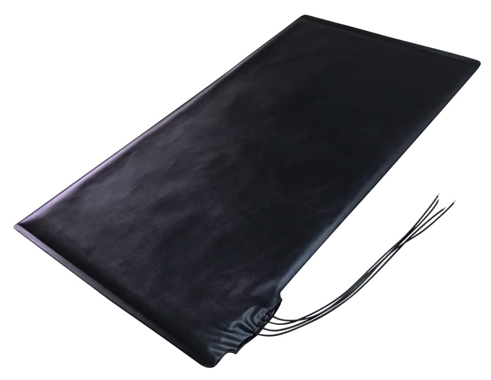

# Introduction
The goal of this project is to create a presence sensor for a bed that reports its state to Home Assistant and thus can be used in automations. This is achieved by using two pressure sensors attached to an ESP32 micro controller which then relays the information about each half of the bed to the home automation server.
# Fundamentals
First, let us cover some of the basics that are necessary for this project.
## What is ESPHome?
ESPHome is an open source platform that allows users to configure microcontrollers and integrate them into smart home systems such as Home Assistant. As such microcontrollers are very inexpensive, they are ideal for implementing your own smart home projects.

ESPHome can be setup quite easily. There is a test version available at [https://web.esphome.io/](https://web.esphome.io/) and it can be self-hosted (for free) with Home Assistant or as an independent Docker container. I will go into further details on this in the [`setup`](#setup-of-esphome) part later.
## Which devices does ESPHome support?
ESPHome *primarily* supports microcontrollers from the ESP8266 and ESP32 families, both manufactured by the Chinese company [*Espressif Systems*](https://www.espressif.com/). Some of the popular microcontrollers that can be used for ESPHome projects include the following:
* ESP8266-based microcontrollers
  * [NodeMCU](https://www.nodemcu.com/)
  * [Wemos D1 Mini](https://www.wemos.cc/en/latest/d1/d1_mini.html)
  * [ESP-01](https://www.utmel.com/components/esp-01-wi-fi-module-esp-01-pinout-programming-and-esp-01-vs-esp8266-faq?id=990)
  * [ESP-12E and ESP-12F](https://www.elecrow.com/blog/things-you-should-know-about-esp8266-wifi-module.html)
* ESP32-based microcontrollers
  * [ESP32 Dev Kit](https://www.espressif.com/en/products/devkits/esp32-devkitc)
  * [Wemos D32](https://www.wemos.cc/en/latest/d32/d32.html)
  * [ESP32-CAM](https://www.arducam.com/esp32-machine-vision-learning-guide/) (an ESP32 based system which offers an onboard camera module for around $7)

ESP32 and ESP8266 are *only* the chips themselves: They are the platforms and are manufactured by *Espressif Systems*. These are *System on a Chip* (SoC) designs, meaning they integrate various components such as CPU, memory, and wireless connectivity onto a single chip.

There are several variants of these chips: Espressif Systems offers different ESP32/ESP8266 chip variants with varying features such as number of cores (single or dual), clock speed, and memory capacity.

These SoCs are then placed on different boards: Several companies produce development boards specifically designed for ESP32/ESP8266 chips. These boards typically include additional components such as voltage regulators, USB ports, and breakout pins for connecting external sensors or devices.

Although ESPHome primarily runs on [ESP32](https://esphome.io/components/esp32) and [ESP8266](https://esphome.io/components/esp8266)-based platforms it also includes limited support for [RP2040](https://esphome.io/components/rp2040)-based chips and chips based on the [LibreTiny](https://esphome.io/components/libretiny) platform.

# Application Example: A bed presence sensor
In this project we are going to build a presence sensor which reports to Home Assistant whether someone is lying in bed. Moreover we are going to use two sensors which allows us to determine which of the two halfs of a bed are occupied.

I have divided this project into two main sections: First, we'll cover the hardware, and then we'll take a look at the software, where we'll set up ESPHome, among other things.
## Hardware

### Microcontroller
In this project we will use an ESP-32 development board which can be acquired on different platforms like [Amazon.com](https://www.amazon.com/s?k=ESP32), [Amazon.de](https://www.amazon.de/s?k=esp32) or [AliExpress](https://www.aliexpress.us/w/wholesale-esp32.html) for less then $10.

I suggest that you look for a microcontroller that uses USB-C instead of micro-USB to be more future-proof. Unfortunately, I did not explicitly check for this when I ordered my ESP32, so I am stuck with micro-USB. Don't make the same mistake I did.


### Pressure sensor
To determine if someone is in bed, we use a pressure sensor. To be precise: We will use two sensors, one for each half of the bed. This way we can determine if there are `0`, `1` or `2` people in bed. This allows for even more possible automations, which we will cover later.

The pressure sensor we use is a `PM156`, manufactured by the company `COMUS Group`. It can be obtained on different places like [SwitchElectronics](https://www.switchelectronics.co.uk/products/large-pressure-alarm-switch-mat-720-x-390mm-pm156) (where I bought mine from), [Amazon.de](https://www.amazon.de/dp/B07P5Z7L77) or [Ebay](https://www.ebay.co.uk/itm/253756658234). As explained above, I bought two, but this project can be done with just one if you are fine with knowing if there is *someone* in bed and not knowing how many people there are.

This pressure sensor is essentially just a switch. When pressure is applied to the mat it pushes its two halfs together and thus closes the circuit.

The pressure mat looks like this:

> Image source: https://www.multice.com/

It has four cables coming out of it. We only need two: from the perspective of this picture, the bottom two. These two complete an electrical circuit if pressure is applied to the mat. The other two cables are irrelevant for this project.
### Power
To power the ESP32 I am using a standard micro-USB cable which I had lying around. As described above you should use a USB-C cable instead. Any cheap power supply does the job as the microcontroller needs a maximum of ~250 mA.
### Cabling
The completed circuit looks like this:


To the right is the ESP32 microcontroller. On the left you can see the two pressure mats, both connected to the ground of the ESP32 and to a GPIO pin.
> Note: It is important which GPIO pins of the ESP32 you connect the pressure mats to, as different pins have different functions.

Moreover you need to connect the ESP32 to power.

To connect the cables of the pressure mats to the ESP32 I recommend using a breadboard to avoid the necessity of soldering.
### Total cost
To summarize all the hardware costs:
* ESP32: 7,79 €
* Pressure mats: 2 x 14 € = 28 €
* Breadboard: 2 €
* USB cable: 2 €
* Power supply: 5 €
* **Total**: 44,79 €

I had the breadboard, usb cable and power supply lying around at home, so the total cost was only about 35 €.
## Software
After setting up the hardware it is time to take a closer look at the software needed for this project.

### Requirements
For this project we need a computer/server on which ESPHome can run. ESPHome does not need to run all the time, it is only needed for setup. So a computer that is not turned on all the time is fine. However, since you probably have a server where your Home Assistant instance is running, I suggest you deploy ESPHome on the same machine. I just added a section to the `docker-compose.yml` of Home Assistant for ESPHome as you can see below.

### Setup of ESPHome
There are multiple ways to use ESPHome. For testing purposes and initialization of the microcontroller it is possible to use a web hosted version of ESPHome available at [https://web.esphome.io/](https://web.esphome.io/). However this is only a lite variant of ESPHome. For bigger projects it is recommended to self-host ESPHome. There are two ways of doing this:

1. If you have a running Home Assistant instance you can install ESPHome as an add-on. The documentation on how to this can be found [here](https://esphome.io/guides/getting_started_hassio).

   `Note:` This is not always possible. If you have setup Home Assistant with a Docker container refer to option `2`. From the [docs of Home Assistant](https://www.home-assistant.io/addons/):
   > Add-ons are only available if you've used the Home Assistant Operating System or Home Assistant Supervised installation method. If you installed Home Assistant using any other method then you cannot use add-ons.
2. The other way to install ESPHome is to create a container for it. This is a simple `docker-compose.yml` example:
   ```yml
   version: '3'

   services:
     homeassistant:
       build:
         image: ghcr.io/home-assistant/home-assistant:latest
       container_name: homeassistant_app
       restart: always
       volumes:
        - ./data/homeassistant/config:/config
       network_mode: host
     esphome:
       image: ghcr.io/esphome/esphome
       container_name: homeassistant_esphome
       volumes:
         - ./data/esphome:/config
         - /etc/localtime:/etc/localtime:ro
       ports:
         - 6052:6052
       environment:
         - USERNAME=admin
         - PASSWORD=mysecretpassword # Change me
   ```
   After running `docker-compose up` ESPHome can be accessed via an web browser on `<Hostname/IP of the server>:6052`.

   > Tip: *If you are tired of typing in ip addresses or hostnames combined with ports and having your browser warn you about insecure websites because of missing HTTP**S**, take a look at NginxProxyManager. It allows you to access your self-hosted services on FQDNs like esphome.mydomain.com with valid SSL certificates.*

When opening the web portal you will be greeted with a login prompt where you have to enter the credentials you've defined in the `docker-compose.yml` (in this case `admin`:`mysecretpassword`)

### Adding the ESP32 to ESPHome

### Configuration of the ESP32
#### Wifi
#### Encryption
#### GPIO

### Integration into Home Assistant and Configuration of Home Assistant
## Example for an automation
# Conclusion